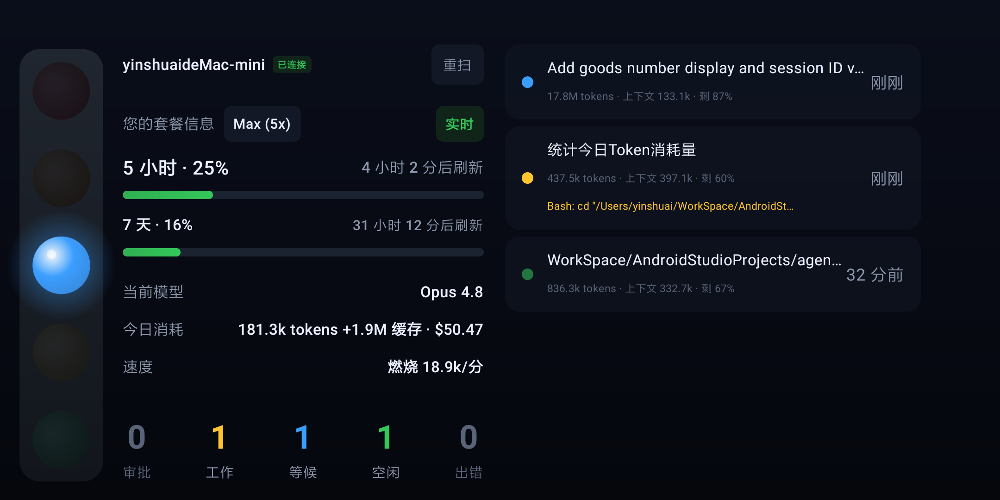

# AgentsHUD

一个跑在 **Android 手机**上的 Claude Code 状态面板：竖排红绿灯一眼看清整体状态，实时展示
每个会话的运行状态、当前调用的工具、上下文剩余、token 消耗、5 小时 / 7 天套餐用量与当前模型。
手机扫描电脑终端里的二维码，在**局域网**内连接，实时刷新。



```
┌──────────────┐   局域网 WebSocket    ┌──────────────────────────┐
│  Android App │  ◀────────────────────│  server (本机 Node)        │
│  (Compose)   │   扫码配对             │  读 ~/.claude 会话数据      │
└──────────────┘                       │  + Hooks + statusLine 上报 │
                                       └──────────────────────────┘
```

由两部分组成：电脑端 **server**（采集 `~/.claude` 数据并通过局域网下发）和 **Android App**（扫码连接、全屏看板）。

---

## 安装电脑端服务（macOS）

**方式 A：一键脚本（推荐）**

自动检测/安装 Homebrew、node，装好服务、**安装 Claude hooks**并启动：

```bash
/bin/bash -c "$(curl -fsSL https://raw.githubusercontent.com/yinshuai0324/agents-hud/main/install.sh)"
```

> 用 `bash -c "$(curl …)"` 形式（不要用 `curl … | bash`），否则脚本里的安装提示读不到键盘输入。

**方式 B：手动 Homebrew**

```bash
brew install node                              # 运行依赖（已装可跳过）
brew tap yinshuai0324/agents-hud https://github.com/yinshuai0324/agents-hud
brew trust yinshuai0324/agents-hud             # Homebrew 6+ 需信任第三方 tap（一次性）
brew install agents-hud
agents-hud setup-hooks                         # 安装 Claude hooks（强烈建议）
brew services start agents-hud                 # launchd 托管，开机自启、崩溃重启
```

> **hooks 是什么**：装上后状态最准最实时，并能拿到官方用量、上下文剩余、会话标题、当前模型、
> 实时工具调用。不装也能用（靠文件监听推断，只能区分 工作/等候/空闲）。装完**重启正在运行的
> Claude 会话**即可生效。

## 安装手机 App

从 [GitHub Releases](https://github.com/yinshuai0324/agents-hud/releases/latest) 下载最新的
`agents-hud-*.apk` 安装（首次需在系统设置里允许该来源「安装未知应用」）。装好后 App 会**每小时
自检更新**、有新版自动弹窗提示，以后无需再手动下载。

App 为全屏常驻（kiosk）设计：隐藏状态栏/导航栏、屏蔽返回退出、适配挖孔屏，适合做一块常亮看板。

## 配对

App 首次启动进入扫码页 → 对准电脑终端里的二维码 → 自动连接并显示面板。配对信息会保存，
下次启动自动重连。面板左上角“重扫”可重新配对。**手机与电脑须在同一局域网。**

看不到二维码？在电脑上运行 `agents-hud connect` 重新打印。

---

## 常用命令

```bash
agents-hud start | stop | restart    # 管理后台服务
agents-hud status                    # 查看服务状态
agents-hud update                    # 升级到最新版（有更新才重启）
agents-hud connect                   # 打印配对二维码 + 连接信息
agents-hud setup-hooks               # 安装 Claude hooks（uninstall-hooks 移除）
agents-hud help                      # 全部命令
```

---

## 看懂面板

### 五种状态

红绿灯每盏对应一个会话状态，亮哪盏由优先级决定：**出错 > 审批 > 等候 > 工作 > 空闲**。

| 颜色 | 状态 | 含义 |
|------|------|------|
| 🔴 红 | **出错** | 运行因错误中止 |
| 🟠 橙 | **审批** | 在等你批准权限 / 通知 |
| 🔵 蓝 | **等候** | 答完一轮，轮到你 |
| 🟡 黄 | **工作** | 正在跑（提交 prompt / 调工具）|
| 🟢 绿 | **空闲** | 长时间无活动 |

- **出错 / 审批不会自动褪色**——这俩是没处理的事项，会一直亮到该会话有新动作；工作久了降为等候，
  等候久了降为空闲。
- 切换状态时大灯先呼吸几下再常亮；切到“审批 / 等候”时还有一次全屏呼吸提醒。
- 手机**未连接**时：红绿灯熄灭、计数归零、其余数据变灰并显示“更新于 X 前”，避免把过期数据当实时。

### 会话列表

每条会话展示：

- **标题**：会话名，没有时回退为路径，如 `project/agents-status/server`
- **token + 上下文剩余**：`928.3k tokens · 上下文 273.4k · 剩 73%`
- **实时工具调用**（工作时）：`Bash: npm run build`、`Edit UsageBar.kt`

左侧信息列：套餐、5 小时 / 7 天用量、当前模型、今日消耗、速度。5h/7d 用量带「实时 / 估算」标记——
装了 hooks 后是 Claude 的官方数字（实时），否则是本地估算。

**今日消耗**：当天（本地零点起）全部会话的 token 与**等值费用**，如 `1.7M tokens · $33.86`。直接全量
扫描 `~/.claude` 的会话记录、按消息时间戳归到当天、按 `message.id` 去重后逐模型累加，因此今早跑完、
现在已闲置的会话也照样算得到。费用按各模型的官方按量计费价折算（含缓存读写的差异定价）——订阅用户
并不会真的按这个金额扣费，它是“若走 API 付费”的等值估算，口径与 ccusage 一致。

### 自动更新

App 启动时及每隔 1 小时查一次 GitHub Releases，发现新版本就**自动弹窗**「立即更新 / 稍后」。
选「立即更新」会下载并覆盖安装（所有版本同一签名，无需卸载）；选「稍后」保留顶部横幅可随时点。

---

开发、维护、数据契约、环境变量、发版等见 **[docs/DEVELOPMENT.md](docs/DEVELOPMENT.md)**。
