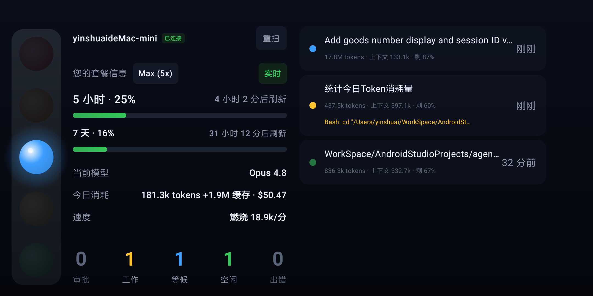

# AgentsHUD

一个 Claude Code 状态面板：竖排红绿灯一眼看清整体状态，实时展示每个会话的运行状态、当前调用的
工具、上下文剩余、token 消耗、5 小时 / 7 天套餐用量与当前模型。**Mac App 是中枢**（菜单栏面板 +
内置数据服务），另可搭配 **Android 手机**（扫码、局域网连接，做一块常亮大屏）和 **ESP32 圆屏摆件**
（WiFi 直连，桌面常亮用量表盘）。



```
┌──────────────────────────────────────────────┐
│  Agents-HUD.app（Mac 菜单栏，内置 server:4317） │
│  读 ~/.claude 会话数据 + Hooks/statusLine 上报  │
│  Bonjour 发布 · Sparkle 自更新 · 设备管理       │
└──────┬────────────────┬──────────────────────┘
       │ 局域网 WebSocket │ WS /device（紧凑流）
       │  （扫码配对）     │  首次用 BLE 配网下发 WiFi
┌──────▼───────┐  ┌──────▼──────────┐
│  Android App │  │  ESP32 圆屏表盘  │
│  (Compose)   │  │  (LVGL, WiFi)   │
└──────────────┘  └─────────────────┘
```

**安装只需一步**：从 [GitHub Releases](https://github.com/yinshuai0324/agents-hud/releases/latest)
下载 `agents-hud-*-mac.dmg`，拖进「应用程序」打开即可 —— 数据采集服务内置在 App 里，
不再需要 Homebrew / Node。App 内可一键安装 Claude hooks、弹出手机配对二维码、配网/升级 ESP32
设备，并通过 Sparkle 自动检查自身更新。

> **hooks 是什么**：右键菜单栏图标 →「安装 Claude Code 钩子」。装上后状态最准最实时，并能拿到
> 官方用量、上下文剩余、会话标题、当前模型、实时工具调用。不装也能用（靠文件监听推断，只能区分
> 工作/等候/空闲）。装完**重启正在运行的 Claude 会话**即可生效。

> **从 brew 旧版迁移**：新版 App 启动时若发现旧的 brew 服务占着 4317 端口，会提示你执行
> `brew services stop agents-hud`。hooks 无需重装（脚本路径不变）。brew 安装方式已停止维护，
> `server/`、`install.sh`、`Formula/` 将在后续版本移除。

## 安装手机 App

从 [GitHub Releases](https://github.com/yinshuai0324/agents-hud/releases/latest) 下载最新的
`agents-hud-*.apk` 安装（首次需在系统设置里允许该来源「安装未知应用」）。装好后 App 会**每小时
自检更新**、有新版自动弹窗提示，以后无需再手动下载。

App 为全屏常驻（kiosk）设计：隐藏状态栏/导航栏、屏蔽返回退出、适配挖孔屏，适合做一块常亮看板。

## 配对

App 首次启动进入扫码页 → 右键 Mac 菜单栏图标 →「连接手机…」弹出二维码 → 扫码自动连接并显示
面板。配对信息会保存，下次启动自动重连。面板左上角“重扫”可重新配对。**手机与电脑须在同一局域网。**

## Mac 菜单栏 App（中枢）

菜单栏常驻，数据服务内置（监听 `0.0.0.0:4317`，供本机面板、手机与 ESP32 设备共用）。

- **菜单栏图标**：sparkle ✶ + 右下角状态色小点（黄=工作 / 蓝=等候 / 橙=审批 / 红=出错 / 绿=空闲），
  不展开也能一眼看状态。
- **左键**弹出毛玻璃悬浮面板：套餐、5h / 7d 用量、当前模型、今日消耗、速度（与手机端同款，竖排紧凑版）。
- **右键**菜单：通知开关 / 连接手机（配对二维码）/ 设备（ESP32 配网 + 固件升级）/ 安装 Claude Code
  钩子 / 检查更新 / 刷新 / 退出。
- **状态通知**：AI 答完一轮（轮到你）、等你审批、或出错时，弹系统横幅 + 提示音——切到别的窗口
  也不会错过。首次打开按系统提示**允许通知**。
- **自动更新**：内置 Sparkle，有新版会在应用内提示并原地升级（也可右键「检查更新…」手动检查）。

DMG 为通用二进制（Apple Silicon / Intel 通吃，需 macOS 13+），经 **Apple 公证**，双击正常打开、
无 Gatekeeper 提示。从源码构建见 [`mac/README.md`](mac/README.md)。

## ESP32 圆屏摆件（可选，WiFi）

用 Waveshare **ESP32-S3-Touch-AMOLED-1.75**（466×466 圆形 AMOLED）做的桌面表盘：
5 小时 / 7 天用量卡片、重置倒计时、工作状态（思考中…/等你回复 ×N），点按屏幕切换
「用量 → Clawd 像素宠物 → 详情」三个页面，宠物会按烧 token 速率睡觉/写代码/蹦迪。
侧面 BOOT 键短按旋转屏幕 90°（记忆方向），**长按 3 秒重新配网**。

**WiFi 直连**：插上任意 USB 电源即可，不用一直连着电脑。

1. 首次使用：屏幕显示「等待配对 · F232」→ Mac 菜单栏右键 →「设备…」→ 扫描 → 选中设备，
   输入 WiFi 名称和密码（2.4GHz）→「下发配置」。配置通过蓝牙一次性写入，之后全程走 WiFi。
2. 配好后设备直连 Mac 上的 4317 服务；Mac 换了 IP 也不用管——设备会通过 Bonjour/mDNS 自动
   找回服务。
3. **固件升级**走 USB：把设备用数据线连上 Mac →「设备」窗口 →「检查最新固件」→「烧录」。
   App 会自动让设备进入下载模式、分块写入并逐块校验。

固件编译烧录、协议与硬件坑见 [`esp32/README.md`](esp32/README.md)；完整通信协议见
[`docs/PROTOCOL.md`](docs/PROTOCOL.md)。

---

## 看懂面板

### 五种状态

红绿灯每盏对应一个会话状态，亮哪盏由优先级决定：**出错 > 审批 > 等候 > 工作 > 空闲**。

| 颜色 | 状态 | 含义 |
|------|------|------|
| 🔴 红 | **出错** | 运行因错误中止 |
| 🟠 橙 | **审批** | 在等你批准权限 / 通知 |
| 🔵 蓝 | **等候** | 答完一轮，轮到你 |
| 🟡 黄 | **工作** | 正在跑（提交 prompt / 调工具）|
| 🟢 绿 | **空闲** | 长时间无活动 |

- **出错 / 审批不会自动褪色**——这俩是没处理的事项，会一直亮到该会话有新动作；工作久了降为等候，
  等候久了降为空闲。
- 切换状态时大灯先呼吸几下再常亮；切到“审批 / 等候”时还有一次全屏呼吸提醒。
- 手机**未连接**时：红绿灯熄灭、计数归零、其余数据变灰并显示“更新于 X 前”，避免把过期数据当实时。

### 会话列表

每条会话展示：

- **标题**：会话名，没有时回退为路径，如 `project/agents-status/server`
- **token + 上下文剩余**：`928.3k tokens · 上下文 273.4k · 剩 73%`
- **实时工具调用**（工作时）：`Bash: npm run build`、`Edit UsageBar.kt`

左侧信息列：套餐、5 小时 / 7 天用量、当前模型、今日消耗、速度。5h/7d 用量带「实时 / 估算」标记——
装了 hooks 后是 Claude 的官方数字（实时），否则是本地估算。

**今日消耗**：当天（本地零点起）全部会话的 token 与**等值费用**，如 `1.7M tokens · $33.86`。直接全量
扫描 `~/.claude` 的会话记录、按消息时间戳归到当天、按 `message.id` 去重后逐模型累加，因此今早跑完、
现在已闲置的会话也照样算得到。费用按各模型的官方按量计费价折算（含缓存读写的差异定价）——订阅用户
并不会真的按这个金额扣费，它是“若走 API 付费”的等值估算，口径与 ccusage 一致。

### 自动更新

App 启动时及每隔 1 小时查一次 GitHub Releases，发现新版本就**自动弹窗**「立即更新 / 稍后」。
选「立即更新」会下载并覆盖安装（所有版本同一签名，无需卸载）；选「稍后」保留顶部横幅可随时点。

---

开发、维护、数据契约、环境变量、发版等见 **[docs/DEVELOPMENT.md](docs/DEVELOPMENT.md)**。
